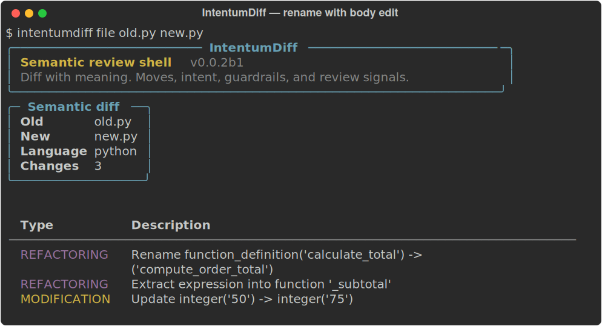

# Rename, extraction and body edits: candidate evidence

Tracks [core#44](https://github.com/buchochelliq-labs/intentumdiff-core/issues/44),
[core#45](https://github.com/buchochelliq-labs/intentumdiff-core/issues/45),
[core#47](https://github.com/buchochelliq-labs/intentumdiff-core/issues/47), and
[Python#45](https://github.com/buchochelliq-labs/intentumdiff-python/issues/45).
This is Linux x86_64 development-candidate evidence, not release certification.

## Observed behavior

Compare [old.py](old.py) and [new.py](new.py): three separate changes survive:
`calculate_total` becomes `compute_order_total`, `_subtotal` is extracted, and the cap changes
from `50` to `75`. The cap owns a separate meaningful-change group.



[Plain CLI output](cli.txt). This is actual output from the installed wheel's CLI, recorded
through Rich and rendered from SVG to PNG. The window decoration is generated; it is not an
operating-system screenshot. The installed console script was separately run successfully.
The banner reports the existing candidate version `0.0.2b1`; nothing was published or tagged.

## Artifact verification

Built using the Python repository's real maturin configuration, staged Rust source, the C ABI
and real Python/JavaScript/TypeScript parser components. Installed in a fresh environment,
with no source checkout on `PYTHONPATH`. Verified import and loaded library paths under the
new environment's `site-packages`; backend is `_CtypesBackend`.

- Wheel: `intentumdiff_python-0.0.2b1-py3-none-manylinux_2_39_x86_64.whl`.
- SHA-256: `6db8c91158cab2b48f0eb56ff7e2b33e2d9280bae290b7633f05c48a34fefdbc`.
- Rust library suite: **269 passed, 25 feature-gated checks ignored**, with the mapped
  INI/assembly/Python parser components staged for the edit matrix.
- Installed-wheel focused checks: **69 passed**.
- Source-checkout public wrapper/scenario checks: **97 passed, 2 existing expected failures**
  (JavaScript added-parameter and import/use noise).
- Immutable-ref provisioning regression: passed; CI can fetch the exact candidate core SHA.

The wheel is an unoptimised local correctness build with two parser components. It is not
an all-language, all-platform release artifact. Supported-platform builds, complete component
provenance and the full Python CI suite remain required release gates.

## Boundary audit and independent judgment

Correction to the initial audit: production `differ.py` already imported invariance evaluation
from `rust_core.py`. No production imports of legacy `analysis.invariances` were found.
The active duplicate code was literal-label enrichment and recursive tree equivalence; both
now delegate to shared Rust handlers through thin DTO adapters.

Independent probes found that character slicing corrupted byte-based parser spans after
non-ASCII text. Rust now uses UTF-8 byte columns; actual Unicode-prefix, U+2028 and CRLF
cases preserve labels. String and character whitespace remains data.

The legacy Python evaluator and Rust agree on `1→0x1`, `1_000→1000`, `50→75` and adjacent
large integers. They differ on arbitrary-precision integers beyond i128, unicode escapes and
some numeric spellings. Those are catalogue/evaluator completeness work under
[core#39](https://github.com/buchochelliq-labs/intentumdiff-core/issues/39), not active wrapper drift.
Neither implementation is an oracle: JSON adjacent integers and JavaScript negative zero must
remain distinct where runtime semantics distinguish them.

Both implementations incorrectly treated CSS selectors/text as colors. The active Rust rule
now only canonicalizes whole values of known color properties. Selectors, strings, custom
properties and nested custom-property token streams remain uninterpreted.

## Independent reviews and bounded behavior

Independent agents reviewed matching, extraction, and the wrapper boundary/CSS work. Review
found and retested cross-scope matches, lost statement/decorator order, ambiguous positional
fallbacks, short-name body loss, shadowed helpers, definition-time effects and Unicode spans.
All blockers in these scoped changes were fixed and independently confirmed.

Extraction deliberately requires a unique added module-level helper defined before its caller,
a single supported return expression, unchanged simple arguments and exact replacement context.
It rejects shadowed names, annotations, decorators, changed expressions, side-effecting helper
bodies and ambiguous occurrences. This is structural recognition, not a general proof of
runtime equivalence. Unsupported extraction shapes stay explicit changes.

Known remaining output limits: a genuinely modified decorator may report its argument edit
without separately asserting its ambiguous reorder; one operator-based rename case retains
extra block-move noise. These are tracked in [core#48](https://github.com/buchochelliq-labs/intentumdiff-core/issues/48)
and [core#49](https://github.com/buchochelliq-labs/intentumdiff-core/issues/49).
Literal evaluator completeness is [core#50](https://github.com/buchochelliq-labs/intentumdiff-core/issues/50).
Neither output limitation hides the tested meaningful edits.

## Reproduction inputs

Original core RC: `80003118bff83eba645ad259bc9a44d36f63a5ab`.
Original Python RC: `06f0dcc1830f648f413f2a0ed45e802f436e1e53`.
Parser sources built with Rust 1.98.1 for `wasm32-wasip2`:

- Python: `4d825be9e26f96871539b990d1171b1815b8538f`.
- JavaScript/TypeScript: `c7ae6476889dd0db4a88907735ed06c7f155d07b`.
- INI (Rust edit matrix): `339ec28e9f2ffdc5d18cd41ecf0911daf244f108`.
- Assembly (Rust edit matrix): `457411a27d3d928313ea7cda1dae97ddf68a533e`.
- SDK: `v0.0.2-beta.1` (`eab92af5`).

```sh
python scripts/provision_build_inputs.py --core-dir ../intentumdiff-core --wasm-dir COMPONENTS
maturin build --bindings cffi --profile dev --no-default-features
python -m pytest tests/unit/test_rename_body_edit.py tests/unit/test_rust_semantic_boundary.py -q
intentumdiff file old.py new.py
```

Always verify the loaded cdylib path after rebuilding. Rust tests may update only an rlib;
use an explicit cdylib build for ctypes probes. Analytics fixtures need a fresh temporary
directory to avoid process-ID database collisions across runs.
